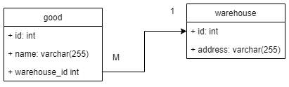

# jdbc-plain-example

Simple CRUD application with JDBC and MySQL.

This project is very simple dummy example for CRUD application.

In this project we learn how to create MySQL DataSource.
After that we will create dummy DAO for model - Good and Warehouse.



All DDL operations:

```sql
CREATE DATABASE library CHARACTER SET utf8;

USE library;

CREATE TABLE warehouse
(
    id      INT UNSIGNED NOT NULL AUTO_INCREMENT,
    address VARCHAR(255),
    PRIMARY KEY (id)
);

CREATE TABLE good
(
    id           INT UNSIGNED NOT NULL AUTO_INCREMENT,
    name         VARCHAR(255) NOT NULL,
    warehouse_id INT UNSIGNED,
    PRIMARY KEY (id),
    FOREIGN KEY (warehouse_id) REFERENCES warehouse (id)
        ON DELETE CASCADE
        ON UPDATE CASCADE
);
```

We will create interface DAO and implementation on JDBC.
And cover all code with logging.

### Inside:
* JDBC and MySQL as database
* Plain SQL without any ORM frameworks
* DAO pattern
* Java 8
* Maven
